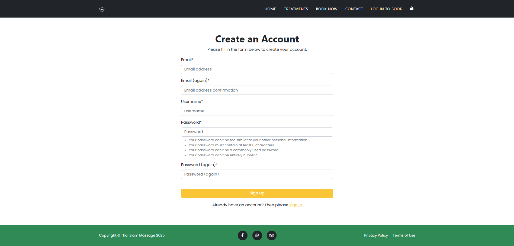
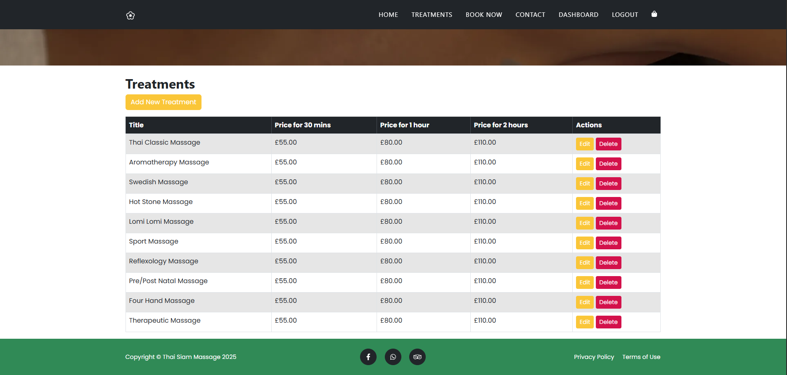
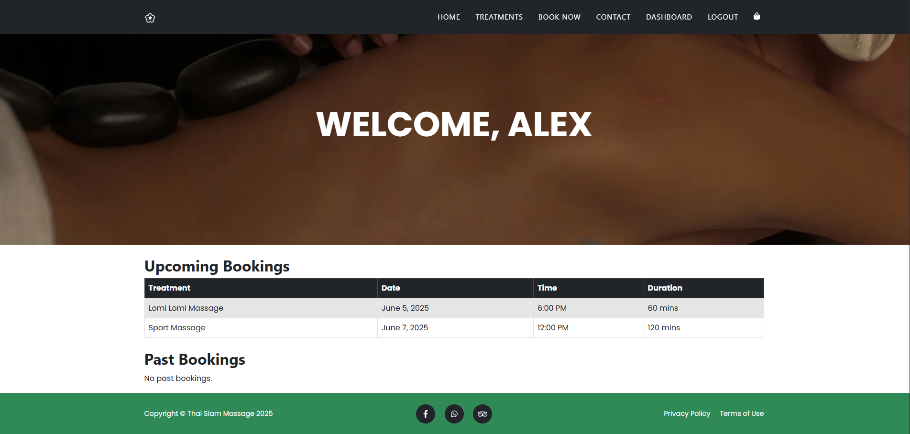

# **Thai Siam Massage**
## Table of Contents
1. [User Experience](#user-experience)
    - [Goals](#goals)
    - [Business Goals](#business-goals)
    - [User Stories](#user-stories)
2. [Design](#design)
    - [Colour Scheme](#colour-scheme)
    - [Typography](#typography)
    - [Imagery](#imagery)
    - [Programs Used](#programs-used)
3. [Features](#features)
    - [General Features](#general-features)
    - [All pages](#all-pages)
    - [Nav bar](#nav-bar)
    - [Footer](#footer)
    - [Home Page](#home-page)
    - [Treatments](#treatments)
    - [Book Now](#book-now)
    - [Login](#login)
    - [SignUp](#signup)
    - [Signout](#signout)
    - [Dashboard](#dashboard)
    - [Bag](#bag)
    - [Checkout](#checkout)
    - [Booking Success](#booking-success)
    - [Contact](#contact)
    - [Reset Password](#reset-password)
4. [Technologies used](#technologies-used)
    - [Languages](#languages)
    - [Framework](#frameworks)
    - [Libraries](#libraries)
    - [Platforms](#platforms)
    - [Other Tools](#other-tools)
5. [Local Development & Deployment](#local-development--deployment)
    - [Local Development](#local-development)
        - [Local Preparation](#local-preparation)
        - [Local Instruction](#local-instruction)
    - [Heroku Deployment](#heroku-deployment)
        - [Repository Setup](#setting-up-your-git-repository)
        - [Heroku Setup](#setting-up-the-heroku-app)
6. [Testing](#testing)
    - [Methods](#methods)
    - [Validation](#validation)
    - [General Testing](#general-testing)
    - [Mobile Testing](#mobile-testing)
    - [Desktop Testing](#desktop-testing)
7. [Bugs](#bugs)
    - [known bugs](#known-bugs)
8. [Credits](#credits)
    - [Acknowledgement](#acknowledgement)
9. [Contact](#contact)


# Project 5: Thai Massage Booking System

For Project 5, I developed a comprehensive and user-friendly booking system for a Thai Massage business using a combination of HTML, CSS, JavaScript, Django, Bootstrap, and various additional technologies. The goal was to create a seamless, interactive platform that streamlines the booking process while offering robust functionality for both customers and administrators.

The booking system allows customers to effortlessly book and cancel appointments. By leveraging Django’s powerful backend capabilities, the system handles critical functionalities such as user management, appointment scheduling, and administrative operations. The use of Django-allauth ensures secure authentication and authorisation, allowing users to create accounts, log in, and manage their appointments with ease.

I enhanced the user experience further by implementing different dashboard views for both superusers and normal users. The superuser dashboard offers full administrative access to view and manage all appointments, while the normal user dashboard provides a personalised view with their own booking history and the ability to make new appointments or cancel existing ones.

To facilitate seamless transactions, I integrated a payment system, allowing customers to pay for their bookings online through secure payment methods. The cart functionality ensures that customers can add multiple services to their booking before proceeding to checkout, improving overall usability and convenience.

An important feature of this project is the email notification system. I implemented an automated email feature that sends confirmation emails to customers after booking or cancelling an appointment. These emails contain key details about the appointment, including date, time, and service booked, providing users with immediate confirmation of their actions. Additionally, email reminders are sent to users before their scheduled appointments to ensure they don't miss their booking.

The website’s front-end design uses Bootstrap to ensure full responsiveness and a visually consistent experience across various devices, from desktops to mobile phones. I also used JavaScript to handle key interactive elements, such as email notifications, responsive navigation, and time selection for bookings.

This project not only demonstrates my ability to integrate multiple technologies to create a fully functional system but also provides a real-world solution to efficiently manage bookings for a business. Upon completion and grading, the business will begin using the system to handle real-time bookings, and they have expressed interest in having me further build upon the existing functionality to better meet their evolving needs.

# User experience
## Goals
### Visitor Goals
- Visitors seeking high-quality Thai massage services can easily explore and understand the full range of treatments available through the website.
- Visitors interested in booking a massage can quickly identify the service they require and proceed with making an appointment or booking online.
- Visitors can effortlessly manage their bookings, including the ability to cancel or reschedule appointments before making payments, as well as make new or additional bookings as needed.
- Visitors can easily create a user account and securely log in to manage their bookings. The authentication system allows them to view, modify, or cancel any appointments they have, providing a **personalised** experience.
- Upon logging in, visitors can access their **Dashboard**, where they can view all their confirmed and upcoming appointments in one place.
- Visitors who successfully book an appointment will see a confirmation message and can view their previous and future bookings directly on the dashboard.
- Visitors can use the **Contact Us** form to send messages or inquiries directly to the Thai Massage team, facilitating communication for further assistance or feedback.


### User Goals
- Easily view and navigate the site to obtain information about the Thai massage services offered.
- Access detailed information about the different types of massage treatments available, helping users choose the service that best suits their needs.
- Contact the business through multiple channels, including phone, the **Contact Us** form, or by making an online booking.
- Make a booking for a massage treatment with ease, selecting the desired service and available time slot.
- Securely make payments for bookings online, ensuring a smooth transaction process.
- Reschedule or modify existing bookings before making payment based on their availability and preferences.
- Cancel future bookings if necessary, ensuring flexibility in managing appointments.
- View all current and past bookings on their personalised **Dashboard**.
- Receive confirmation emails upon booking or cancelling, as well as reminders before upcoming appointments.


### Business Goals
- **Display and highlight massage services available**: The website is designed to clearly present the full range of massage services, making it easy for customers to understand the treatments on offer.

- **Provide information on cost, duration, and benefits**: Each treatment includes transparent details on cost, duration, and the benefits, helping customers make well-informed decisions.

- **Encourage customer inquiries**: The site provides multiple methods for customers to contact the business, including phone, the **Contact Us** form, or by booking directly online for more information.

- **Increase customer bookings to grow the business**: By offering a smooth and easy booking process, the business aims to drive more customer appointments and foster business growth.

- **Enable online bookings for business expansion**: The business seeks to expand by offering customers the ability to book appointments online, reducing dependence on phone calls and improving operational efficiency.

- **Increase sales with flexible booking options**: The website allows customers to book appointments during off-peak hours or when phone lines are busy, thus increasing the potential for more bookings and higher sales.


### User Stories

<div align="center"> 
    
</div> 

- As a shopper, I want to register on the website so that I can create an account and access my bookings.
- As a shopper, I want to log in to the website so that I can access my profile and manage bookings
- As a shopper, I want to recover my password so that I can reset it if I forget my credentials

- As a shopper, I want to book a treatment so that I can secure my appointment
- As a shopper, I want to edit my booking so that I can update my treatment details if necessary
- As a shopper, I want to pay for my booking through the website so that I can complete my treatment reservation
- As a shopper, I want to delete my booking so that I can cancel any unwanted treatments

- As a shopper, I want to view my user profile so that I can check my previous and future bookings

- As a site owner, I want to add new treatments, edit and delete them so that I can add more treatments and modify them if needed


# Design
## Colour Scheme
<div align="center"> 
    
</div> 

- #000000 was used in all the font text
- #198754 was used as the main colour such as Footer Background, Button Text, Border and background
- #ffc800 was used as the hover colour of the navbar links
- #FFFFFF was the main background on all ages


## Typography

<div align="center"> 
    
</div>

- My primary font is [Poppins](https://fonts.google.com/specimen/Poppins?query=poppins) which is on all pages of the website
- I used Poppins font as it is clear for everyone to read, whilst also having a great style look for a Massage business


## Imagery
<div align="center"> 
    
</div> 

- These are the photos I used for my website that all are copyright free.
- I researched hundreds of photos to get the best image to represent the relevant area of my business.
- They matched in line with the Businesses and the sectors we are working within.


## Programs Used
- [Link to simple imager resizer](https://www.simpleimageresizer.com/)

- [Link to tiny png](https://tinypng.com/)

- [Link to free convert](https://www.freeconvert.com/)
    - These are the programs I used to resize and convert the image to increase the performance of the site for mobile and desktop usage.


# Features
## General features
### All pages
## Nav Bar
<div align="center"> 
    
</div> 

- This Nav bar is on all pages with the minimal design. 
- This Nav bar is fixed in place, so when you scroll down you can still access all pages.
- If you click on the logo, it will take you back to the home page. 
- Project 4 - There is now 5 pages, as there is a dashboard page added for the user to get more booking table of the future bookings
- Added bag icon at the end of the navbar 

<div align="center"> 
    
</div>

- When user logged in to the site Dashboard will be seen in the navbar.
- If user adds any treatment and unpaid it will show the amount.

<div align="center"> 
    
</div> 

- This is the look of the nav bar in the format of a phone
- I wanted it to look sleeker and user friendly in the style.
- Anything below 768px will show this format by using media queries. 

<div align="center"> 
    
</div> 

- This is the look of the Hamburger Nav.
- When you click on the Menu Button it brings the Nav list up.
- If you click on the logo, it will take you back to the home page.
- Bag icon added and takes to the bag page

## Footer
<div align="center"> 
    
</div> 

- This footer is also accessible on all pages.
- The footer also holds the Privacy Policy and Terms and Conditions but those are not working. You have to add you own terms and conditions and privacy policies.
- The is aligned into the middle of the screen and always white in colour.
-  All the links are working fine.


<div align="center"> 
    
</div> 

- This is what the phone looks like in the phone format.
- Anything below 768px will show this format using media queries.


## Home Page
<div align="center"> 
    
</div> 

- This is my main page Hero, I wanted to make it eye catching, stylish, easy to read, easy to navigate, while also been user friendly.
- With hours of research I thought this image was the best way to convey the type of my business.


<div align="center"> 
    
</div> 

- I added this text to make the front page be attractive to the eye, whilst also been business specific.
- Knowing that there is no background image, I wanted to add text to it to draw people in.


<div align="center"> 
    
</div> 

- I created a section where people can find our place easily.
- It gives the end user another direct link into the Booking page.


## Treatments
<div align="center"> 
    
</div> 

- All the treatments with title, description, price and duration are visible
- It gives the end user another direct link into the Booking page.


## Book now
<div align="center"> 
    
</div> 

- Treatment booking form where user have to select treatment type, treatment duration, time and date to book a schedule
- User must have to be a registered user of Thai Siam Massage and have to login first to book a treatment.


## Login
<div align="center"> 
    
</div> 

- Customer login page where user has to provide email/username and password to login.
- User must have to be a registered user of Thai Siam Massage to login
- There is a direct link to the register page if user is not registered

## Signup
<div align="center"> 
    
</div> 

- Customer can signup for the website.
- User must have to provide real email
- Form validation is handled by django-allauth


## Signout
<div align="center"> 
    
</div> 

- Sign out page comes with django-allauth

## Dashboard
- Created the dashbaord for multiple roles of user
- Superuser can create, view, edit and delete treatments
- Site user wil see their bookings.
- If there is no booking it's just empty with some messages.
- Dashboard for SUPER USER

<div align="center"> 
    
</div> 

- Dashboard for SITE USER
- User can only see the paid future bookings and booking in the past
<div align="center"> 
    
</div>

## Bag
<div align="center"> 
    
</div>

- User can edit or remove treatments from the bag
- User can go to the booking page directly from here and add new treatments to the bag


## Checkout
<div align="center"> 
    
</div>

- Right now this checkout page runs STRIPE TEST PAYMENT
- User can pay from the checkout page and make a booking


## Booking Success
<div align="center"> 
    
</div> 

- After making the payment user will redirected to the successful page
- All the order information is here


## Contact
<div align="center"> 
    
</div> 

- User can send us messages through this form that will be saved to the database
- User's message will send to the owner's email


### Reset Password
<div align="center"> 
    
</div> 

- If user forgot Username or password, user can reset their passwords through links sent to user's email


# Technologies used
## Languages
- [HTML](https://developer.mozilla.org/en-US/docs/Web/HTML)
    - Page markup
- [CSS](https://developer.mozilla.org/en-US/docs/Learn/CSS)
    - Styling
- [JavaScript](https://developer.mozilla.org/en-US/docs/Web/JavaScript)
    - Fronted behaviour control
- [Python](https://www.python.org/)
    - Project Backend Language

## Frameworks
- [Django](https://www.djangoproject.com/)
    - Project Backend

## Libraries 
- [Google Fonts](https://fonts.google.com/)
    - Font style
- [Bootstrap](https://getbootstrap.com/)
    - App Theme and Styling
- [Email.js](https://www.emailjs.com/)
    - To send customer message to the admin's email

## Platforms
- [Github](github.com)
    - Store the code remotely for deployment
- [Gitpod](gitpod.io)
    - Development environment for the project
- [Heroku](https://www.heroku.com/)
    - Deployment
- [Bootstrap Themes](https://startbootstrap.com/)
    - Website Theme
- [AWS](https://aws.amazon.com/)
    - Project Database
- [Postgresql](https://www.postgresql.org/)
    - Database
- [Stripe](https://stripe.com/)
    - Payment System
- [Sendgrid](https://sendgrid.com/)
    - SMTP Server

# Local Development & Deployment
## Local Development
### Local Preparation
**Requirements**
- IDE like [Visual Studio Code](https://code.visualstudio.com/download)
- [Git](https://git-scm.com/)
- [Python](https://www.python.org/downloads/)
- [Django](https://www.djangoproject.com/)
- [Stripe](https://stripe.com/)

### Local Instruction
1. Clone the repository and go inside the folder
```
git clone https://github.com/samanthamoss87/project-5.git
```
2. Open your IDE and open the folder you just cloned
3. Install all the requirements with  ```pip install -r requirements.txt```
4. Comment the production database seeting and add local development database in thai_massage/settings.py
```
DATABASES = { 
    'default': { 
        'ENGINE': 'django.db.backends.sqlite3', 
        'NAME': BASE_DIR / "db.sqlite3"
    }
}
```
5. Create .env file and add your environment variables
```
STRIPE_TEST_PUBLIC_KEY='your_public_key'
STRIPE_TEST_SECRET_KEY='your_secret_key
```
6. Open the terminal and run these commands to create the database
```
python manage.py makemigrations
python manage.py migrate
python manage.py createsuperuser
```
7. Now run this command to run the website
```
python manage.py runserver
```
8. Enjoy the site

## Heroku Deployment
### Setting up your git repository
1. Create a new repository and clone it to your computer
2. Put all the files to the repository folder
3. Create a file called `.python-version` and add python version to it. e.g. 3.12
4. Create a file called Procfile and add this to the file `web: gunicorn your-project-name.wsgi --log-file -`
5. Replace `your-project-name` to your project name e.g. thai-massage-v2
6. Now run these commands to upload the files to Github 
    - `git add .`
    - `git commit -m "your commit message"`
    - `git push`

### Setting up the heroku app
1. Login to your [Heroku](https://www.heroku.com/) account
2. Create a new app and give it a name
3. Connect your GitHub account from deployment method
4. Search and Select your repository
5. Click on Deploy
6. Open terminal in heroku and run these commands to create all the tables
```
python manage.py makemigrations
python manage.py migrate
python manage.py createsuperuser
```

# Testing
## Methods
### Validation 
- HTML has been validated with https://validator.w3.org/#validate_by_input
- CSS has been validated with https://jigsaw.w3.org/ and auto-prefixed with https://autoprefixer.github.io/.
- Links checked with https://validator.w3.org/checklink.
- I also used https://pagespeed.web.dev/
- Javascript codes have been validated with https://jshint.com/
- Python codes are tested with [flake8](https://flake8.pycqa.org/en/latest/)

### Testing Overview

#### General Testing
- **Cross-Browser Testing**: Each feature was thoroughly tested upon implementation across multiple browsers, including Safari and Chrome, to ensure consistent functionality and design across platforms.
- **User Feedback**: The website was shared with family, friends, and selected users for feedback on usability, design, and overall user experience. Feedback was carefully considered and implemented as necessary.
- **Form Validation**: The "Contact Us" form has built-in client-side validation, ensuring that users cannot submit incomplete forms. Validation checks for required fields, proper input formats, and error handling.
- **Image Optimisation & Performance**: All images were optimised for faster loading times and tested on various devices and browsers. Performance testing was conducted to ensure images load efficiently without degrading the user experience.

#### Mobile Testing
- **Device Testing**: The website was tested across a variety of iOS and Android devices, including smartphones and tablets, to ensure responsiveness and a seamless mobile experience. Various screen sizes, resolutions, and operating system versions were considered.
- **Functional Testing**: Extensive testing was performed on touch elements, such as buttons and navigation, to ensure smooth functionality on mobile devices. All interactive features were verified for responsiveness.
- **Mobile Browser Testing**: Chrome and Microsoft Edge's mobile inspection tools were used to simulate different mobile environments and test the site’s mobile responsiveness, style, and functionality.
- **Performance Testing**: Load speed and responsiveness were tested on mobile networks (both 3G and 4G) to ensure the website performs well under varying conditions.

#### Desktop Testing
- **Cross-Browser Compatibility**: The website was designed and tested on a Microsoft laptop and previewed in Chrome and Microsoft Edge to verify desktop compatibility. All features were checked to ensure proper display and behaviour on different browsers.
- **Device Variety**: The site was tested on various desktop and laptop devices, including different screen sizes and resolutions, to ensure optimal user experience across all devices.
- **Usability Testing**: The website was tested by family, friends, and colleagues on different desktop setups to identify any issues related to usability or accessibility. Feedback from this testing was used to make adjustments and improve the design.
- **Responsive Layout**: The desktop version of the site was evaluated for proper alignment, spacing, and content organisation to ensure a user-friendly layout that adapts well to different screen sizes.

#### Additional Testing
- **Accessibility**: The website was tested for accessibility features to ensure compliance with WCAG (Web Content Accessibility Guidelines). This included testing for colour contrast, keyboard navigation, and screen reader compatibility.
- **Security Testing**: Basic security testing was performed, such as verifying form field sanitisation and ensuring data integrity in user input.
- **SEO Testing**: The website was tested for SEO best practices, including proper meta tags, heading hierarchy, alt text for images, and mobile-friendliness to enhance search engine ranking.


# Bugs
## Known bugs
- When admin and user login from the same browser, the username from userdashboard vanishes if the superuser doesn't have a name
- Custom 404 Page is not working properly
- User doesn't get any email after booking a schedule due to smtp server error
- Privacy Policy and Terms and conditions page is not working as awaiting content from the client
- Automated git deployment is not working
- Few pages of django-allauth doesn't inherit the base template


# Credits

## Acknowledgement
- My father in law owns Thai Siam Massage and I was assisted with information regarding the business by his son (my husband) Richard Lane who helped me make the blueprint of the app

# Contact
- Please feel free to contact me at samantha.moss87@aol.com